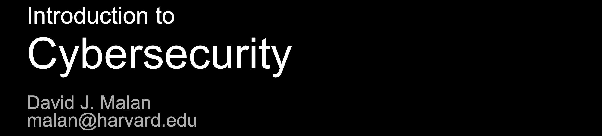

# CS50-Cybersecurity

CS50-Cybersecurity 面向技术与非技术背景人群，是一门网络安全入门课程。学员将学习如何保护个人账号、数据、系统及软件，以抵御当前的各类威胁；同时还将掌握如何识别并评估未来可能出现的威胁（无论在家庭场景还是工作场景中）。此外，课程还将教授如何保护个人隐私，引导学员跳出 “绝对安全” 的思维定式，树立 “相对安全” 理念 —— 网络安全的本质是 “（对攻击者而言的）风险与收益” 及 “（对自身而言的）成本与效益” 的权衡函数，且需认识到网络安全与易用性本身存在取舍关系。

课程中既包含高层级（宏观）威胁案例，也涵盖低层级（微观）威胁案例，能为学员提供理解这两类威胁所需的全部技术知识。课程作业设计均源于真实事件，具有较强的实践参考价值。
