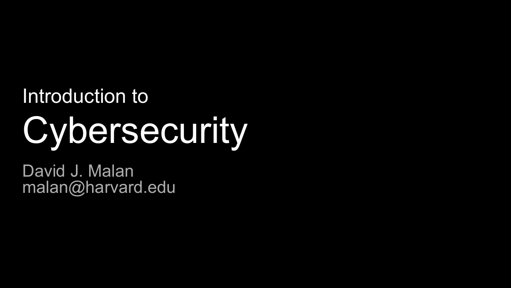

## 关于本项目

为技术与非技术受众介绍网络安全。学习如何在家中和工作中抵御当今威胁以及识别和评估未来威胁，从而保护你的账户、数据、系统和软件安全。学习如何保护自己的隐私。学习用相对而非绝对的视角看待网络安全，即网络安全是对手的风险与收益以及你自身的成本与收益的函数。学习将网络安全视为与可用性之间的权衡。课程既呈现了高级别的威胁示例，也呈现了低级别的威胁示例，为学生提供了理解两者的必要技术知识。作业灵感来源于真实事件。

## 进度表

|                             章节                             |                       视频                       |                         笔记                         |                   源码                    |
| :----------------------------------------------------------: | :----------------------------------------------: | :--------------------------------------------------: | :---------------------------------------: |
| [Week 0 ](https://cs50.harvard.edu/cybersecurity/2023/weeks/0/#week-0-securing-accounts)[*Securing Accounts*](https://cs50.harvard.edu/cybersecurity/2023/weeks/0/#week-0-securing-accounts) | [▶️](https://www.youtube.com/watch?v=X3DVaMnl5n8) | <a href="L0-Securing Accounts\notes\notes.pdf">📝</a> | <a href="L0-Securing Accounts\code">✅</a> |
|                                                              |                                                  |                                                      |                                           |
|                                                              |                                                  |                                                      |                                           |

